# Sequence Diagrams

## Table of Contents

- [Successful sign up](#successful-sign-up)
- [Unsuccessful sign up - invalid form](#unsuccessful-sign-up---invalid-form)
- [Unsuccessful sign up - username already taken](#unsuccessful-sign-up---username-already-taken)
- [Successful sign in](#successful-sign-in)
- [Unsuccessful sign in - invalid form](#unsuccessful-sign-in---invalid-form)
- [Unsuccessful sign in - user not found](#unsuccessful-sign-in---user-not-found)
- [Unsuccessful sign in - invalid password](#unsuccessful-sign-in---invalid-password)
- [Successful image processing](#successful-image-processing)
- [Unsuccessful image processing - image too big](#unsuccessful-image-processing---image-too-big)
- [Unsuccessful image processing - too many images](#unsuccessful-image-processing---too-many-images)
- [Unsuccessful image processing - image processing error](#unsuccessful-image-processing---image-processing-error)
- [Successful image download](#successful-image-download)
- [Unsuccessful image download - too many downloads](#unsuccessful-image-download---too-many-downloads)
- [Successful image share](#successful-image-share)
- [Unsuccessful image share - too many shares](#unsuccessful-image-share---too-many-shares)

### Successful sign up

Expected payload sent by the user should be:

```json
{
  "username": "joseph.cooper",
  "password": "12345678",
  "email": "joseph.cooper@mail.com"
}
```

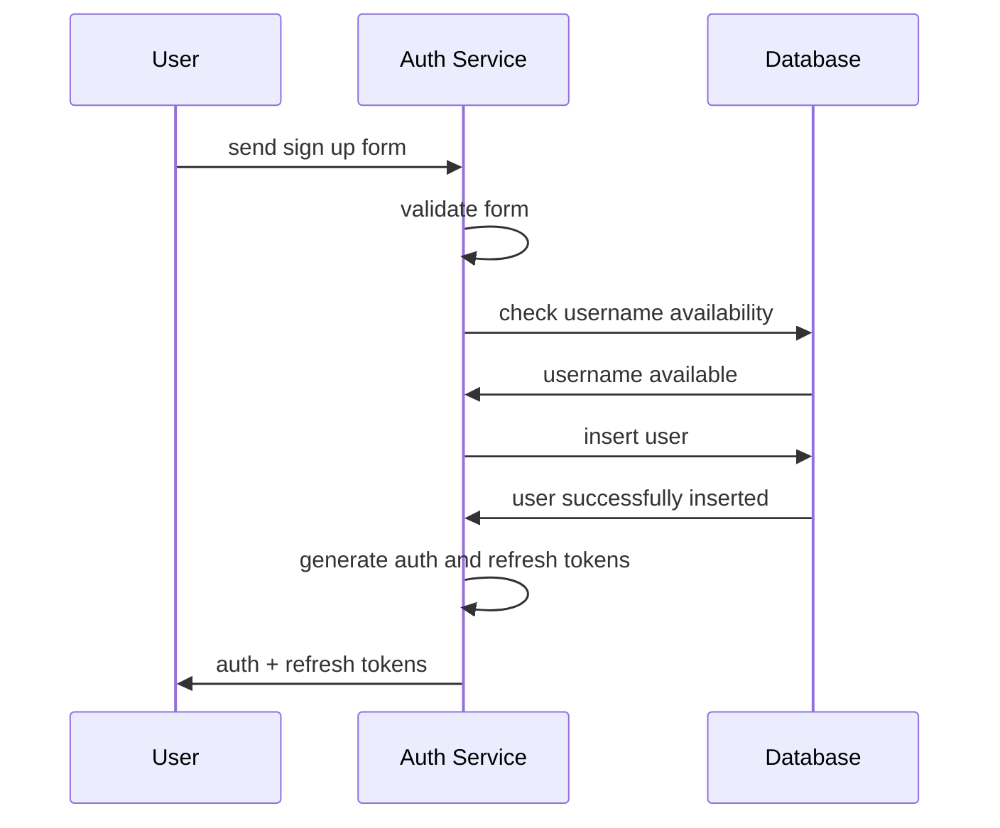

### Unsuccessful sign up - invalid form

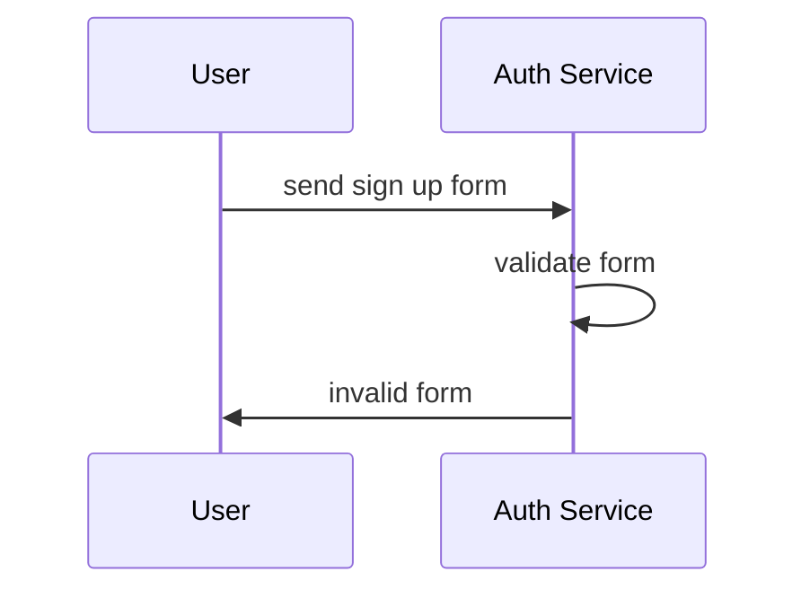

### Unsuccessful sign up - username already taken

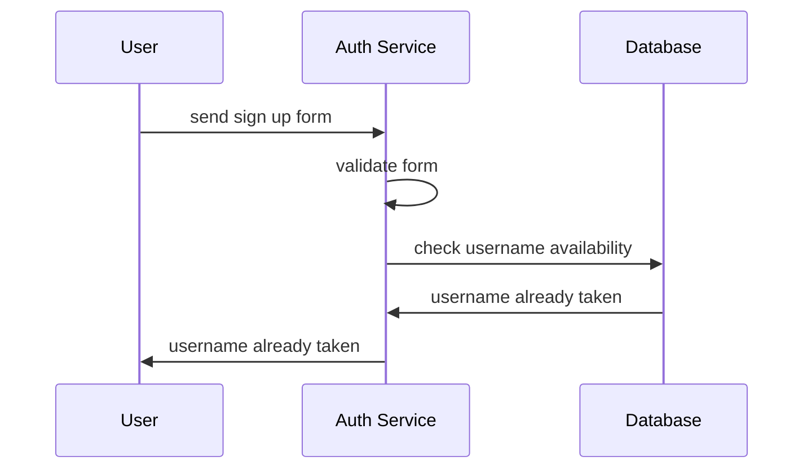

---

### Successful sign in

Expected payload sent by the user:

```json
{
  "username": "joseph.cooper",
  "password": "12345678",
}
```

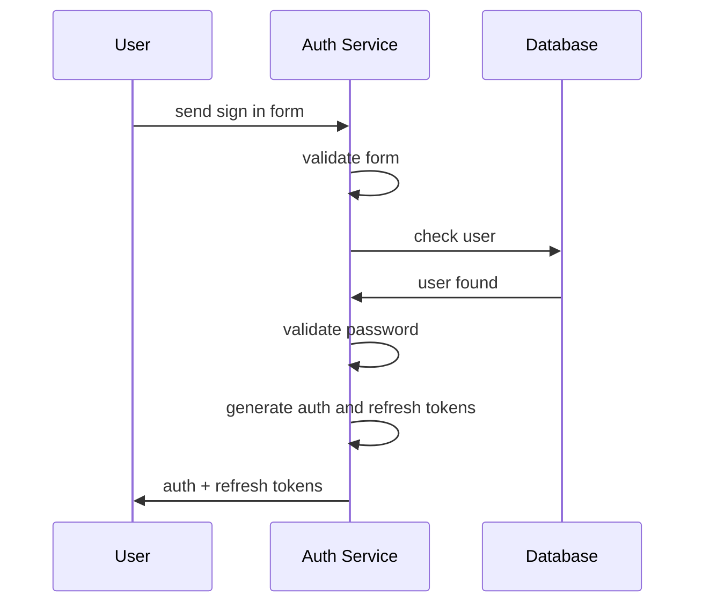

### Unsuccessful sign in - invalid form


### Unsuccessful sign in - user not found

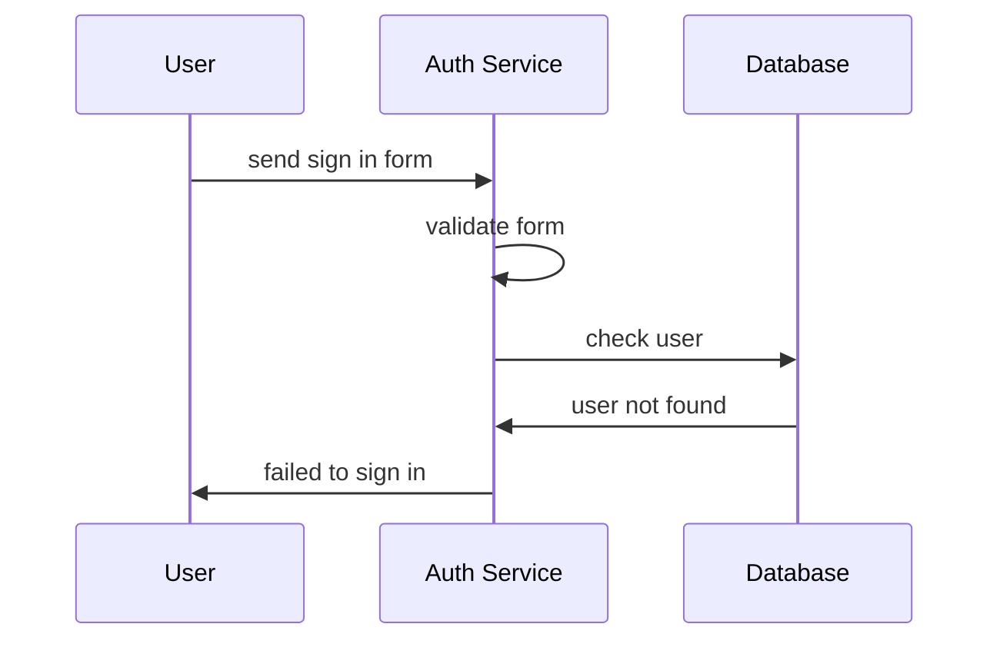

### Unsuccessful sign in - invalid password

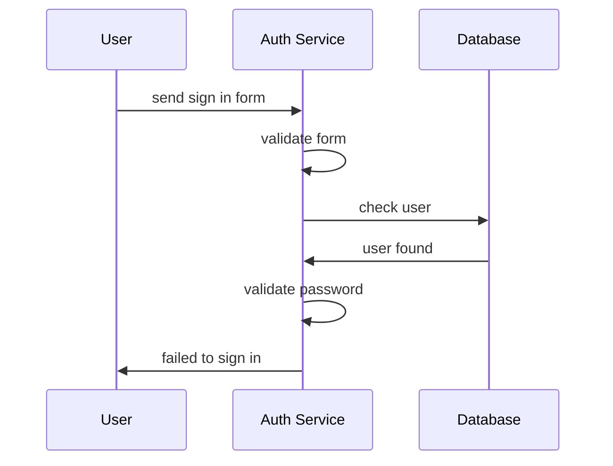

---

### Successful image processing

Expected payload sent by the user:

First, should upload the image as a file. The user will receive an `imageId` as a response.

Then, send the following payload:

```json
{
  "image": "imageId",
  "size": "50%",
  "format": "jpeg",
  "quality": "50"
}
```

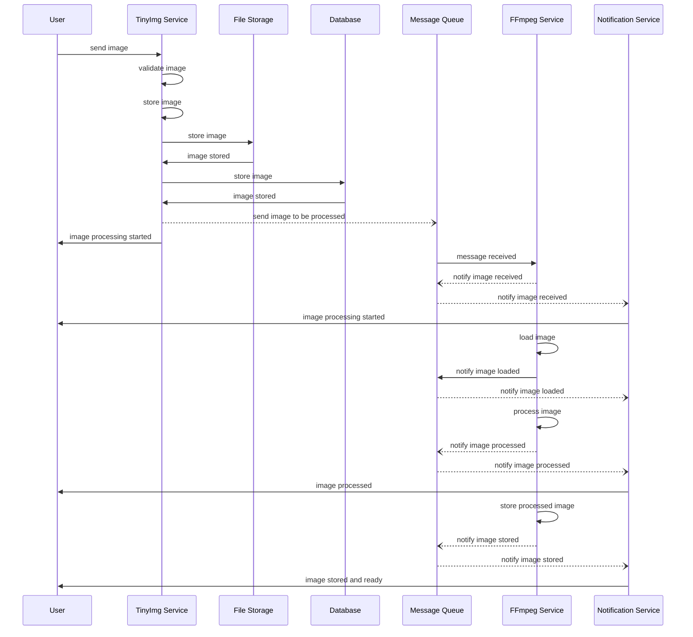

### Unsuccessful image processing - image too big

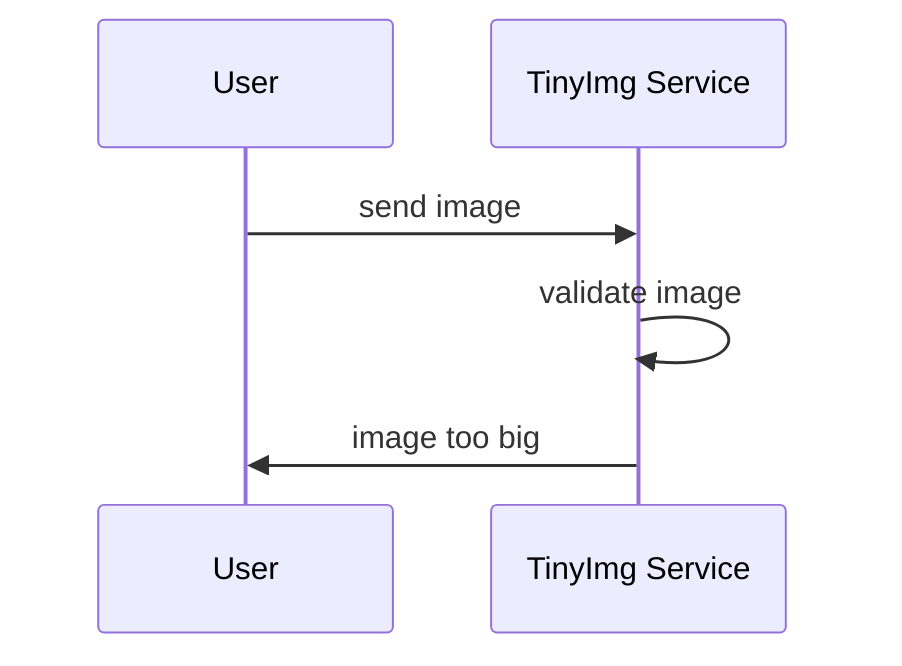

### Unsuccessful image processing - too many images

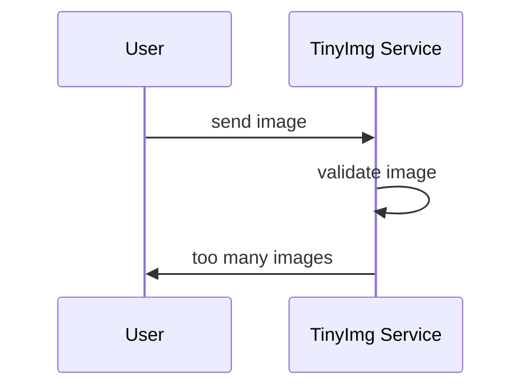

### Unsuccessful image processing - image processing error

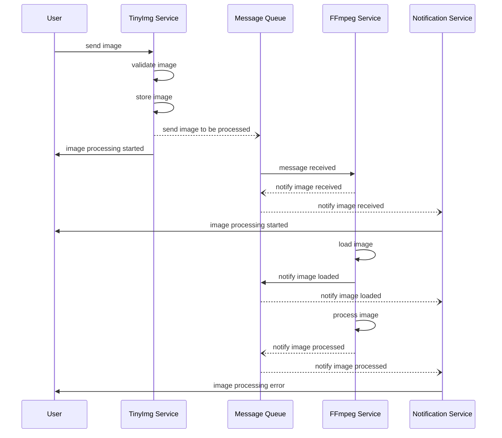

---

### Successful image download

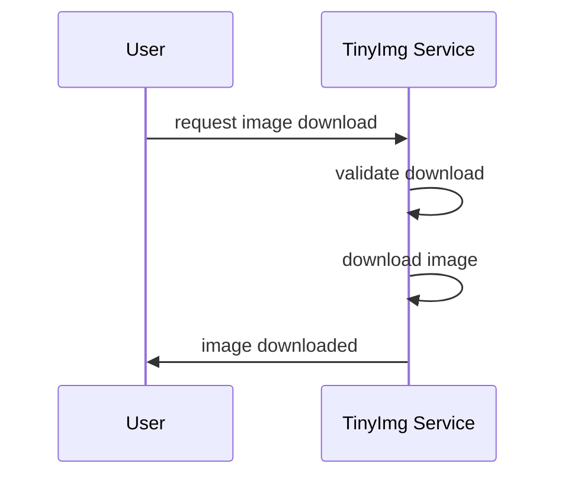

### Unsuccessful image download - too many downloads

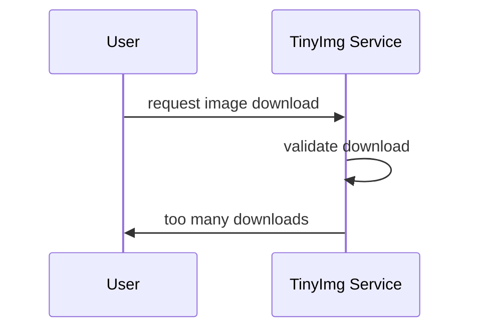

---

### Successful image share

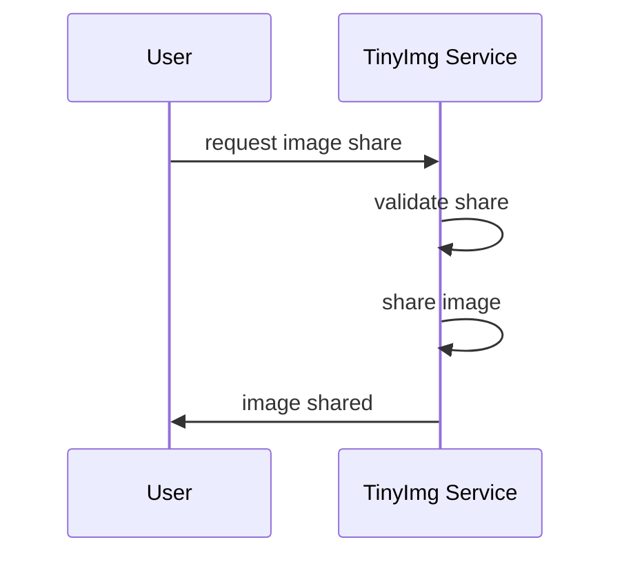

### Unsuccessful image share - too many shares

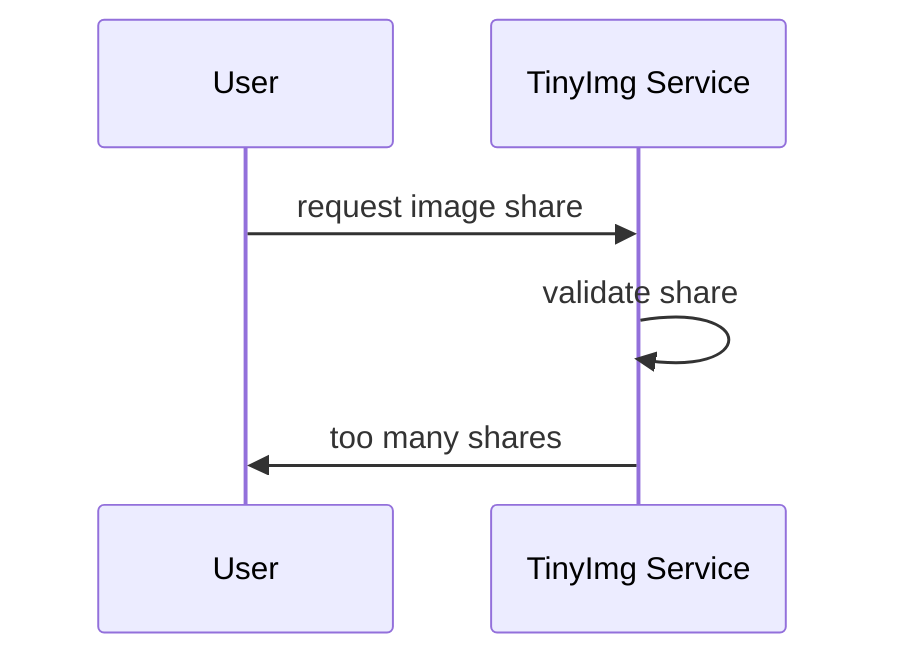
x