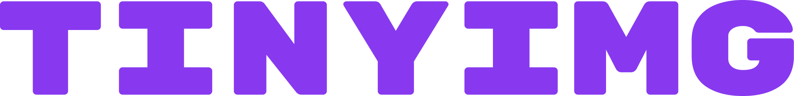
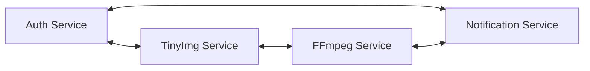

  

## Project scope

With TinyImg you can upload any image you want, and change it's size, format and quality.
You will be able to either store the image in the server, download it directly or even share it with a link.

## Application architecture

## Table of contents

- [Function requirements](#function-requirements)
- [Non-functional requirements](#non-functional-requirements)
- [Business rules](#business-rules)
- [Tech stack](#tech-stack)
- [GoF patterns adopted](#gof-patterns-adopted)
- [Code quality and coverage](#code-quality-and-coverage)
- [Communication protocols](#communication-protocols)
- [ALM - Application Lifecycle Management](#alm---application-lifecycle-management)

## Function requirements

1. The user should be able to sign up.
2. The user should be able to sign in.
3. The user should be able to upload an image.
4. The user should be able to change the image size.
5. The user should be able to change the image format.
6. The user should be able to change the image quality.
7. The user should be able to store the image in the server.
8. The user should be able to download the image converted image.
9. The user should be able to share the image with a link.

## Non-functional requirements

1. The image processing should be done using FFmpeg.
2. The image should be able to store images.

## Business rules

1. The user should be able to upload images up to 5MB.
2. The user should be able to store up to 10 images.
3. The user should be able to store images up to 30 days.
4. The user should be able to download up to 5 images per day.
5. The user should be able to share up to 3 images per day.

## Tech stack

| Technology | Reason | System |
|------------|-------------|------------|
| | NestJS is a powerful TypeScript framework with support for several plugins and extensions out of the box | Authentication Service |
|  | A powerful, open source object-relational database system. | Database |
|  | Swagger is a powerful tool for documenting APIs. | Documentation |
|  | Laravel is a powerful PHP framework with a strong ecosystem and is simple to use | TinyImg Service |
|  | Go is a strong statically typed language with a powerful standard library | FFmpeg Service |
|  | FFmpeg is a powerful multimedia framework that can decode, encode, transcode, mux, demux, stream, filter, and play almost anything that humans and machines have created. | FFmpeg Service |
|  | RabbitMQ is a powerful message broker that can be used to implement the message queue pattern. | Message Queue |
|  | Socket.io is a powerful tool for building real-time applications. | Notification Service |
|  | Docker is a powerful tool for creating, deploying, and managing containers. | Deployment |
|  | GitHub Actions is a powerful tool for automating workflows. | CI/CD |
|  | SonarQube is a powerful tool for code quality and security analysis. | Code Quality |

## GoF patterns adopted

| Pattern | Reason |
|---------|--------|
| Builder | Will be used on Authentication Service to build the user during the sign up process |
| Adapter | Will be used on FFmpeg Service and TinyImg Service to communicate with Message Queue |
| Strategy | Will be used on FFmpeg Service to process the image |

## Code quality and coverage

This will be handled by SonarQube during the CI/CD pipeline. All services must meet a quota of at least **50% code coverage**.

## Communication protocols

| Protocol | Reason |
|----------|--------|
| REST | Will be used to communicate between the user and the TinyImg Service and Authentication Service |
| WebSockets | Will be used to communicate between the Notification Service and the user |
| AMQP | Will be used to communicate between the TinyImg Service, FFmpeg Service, and the Message Queue |

## ALM - Application Lifecycle Management

The project backlog can be found in this [repo project section](https://github.com/orgs/MateuxDotDev/projects/1/views/1).