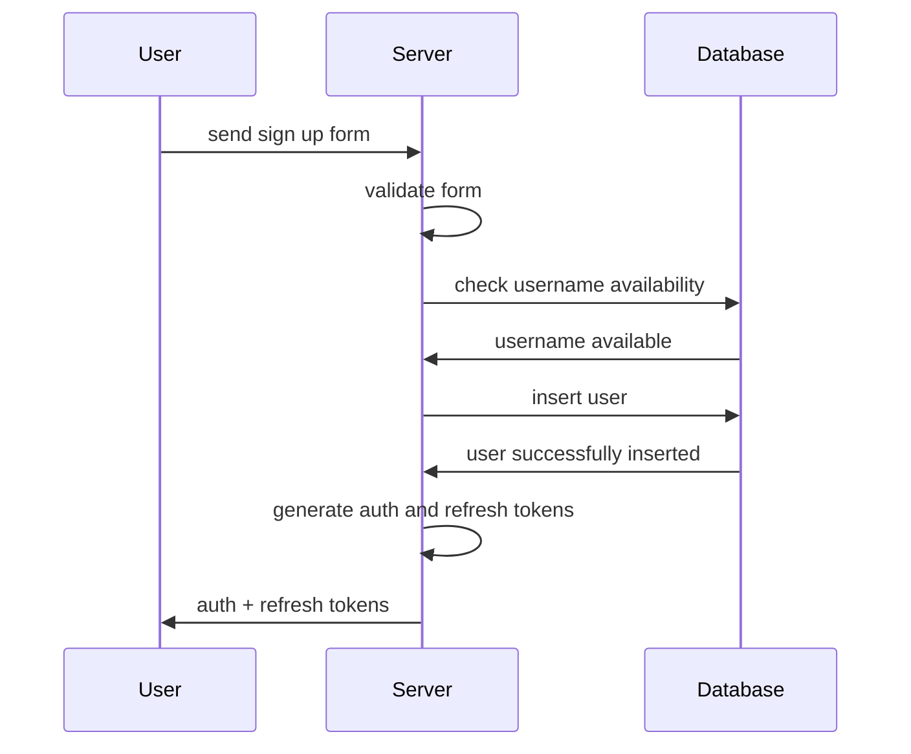

# TinyImg

<!-- TODO: add tiny img logo logo -->

## Project scope

With TinyImg you can upload any image you want, and change it's size, format and quality.
You will be able to either store the image in the server, download it directly or even share it with a link.

## Function requirements

1. The user should be able to sign up.
2. The user should be able to sign in.
3. The user should be able to upload an image.
4. The user should be able to change the image size.
5. The user should be able to change the image format.
6. The user should be able to change the image quality.
7. The user should be able to store the image in the server.
8. The user should be able to download the image converted image.
9. The user should be able to share the image with a link.

## Non-functional requirements

1. The image processing should be done using FFmpeg.
2. The image should be able to store images.

## Business rules

1. The user should be able to upload images up to 5MB.
2. The user should be able to store up to 10 images.
3. The user should be able to store images up to 30 days.
4. The user should be able to download up to 5 images per day.
5. The user should be able to share up to 3 images per day.

## Sequence diagrams

### Sign up

