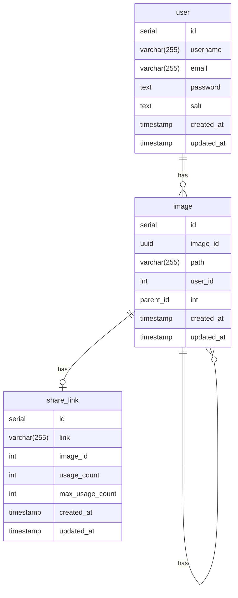

# Database


This project is responsible for storing and managing data for TinyImg users.

## How to run

First, populate a `.env` file with the keys that can be found on [`.env.example`](./.env.example).

Then, run the following command:

```bash
docker compose up
```

And you're good to go!

## Entity Relationship Diagram (ERD)



## ADRs

- [Postgres as Database](./adr/ADR1.md)
- [Entity Relationship Diagram (ERD) for the Image Processing Application](./adr/ADR2.md)