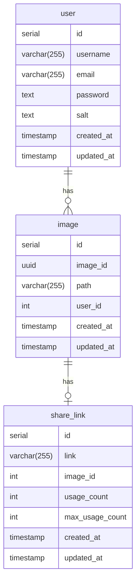

# Database

This project is responsible for storing and managing data for TinyImg users.

## How to run

> _*WIP*_

## Entity Relationship Diagram (ERD)

## ADRs

- [Postgres as Database](./adr/ADR1.md)
- [Entity Relationship Diagram (ERD) for the Image Processing Application](./adr/ADR2.md)